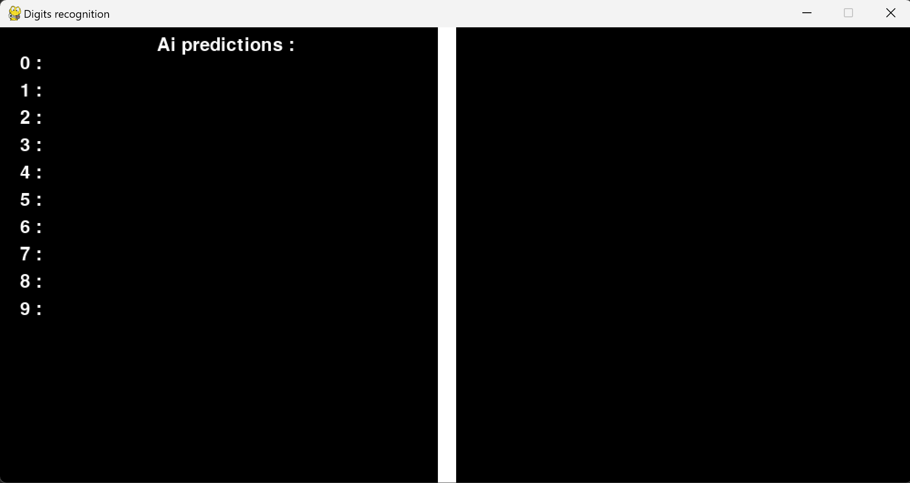
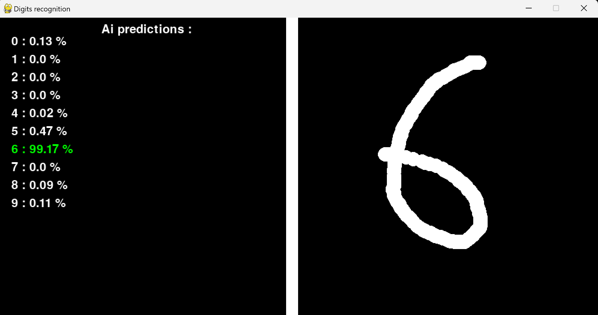

# Digits recognition

Python application to recognize handwritten digits in real time!

### Project's motivations
I've always been interested in Artificial Intelligence and wanted to get my hands on a neural network project.

That's why I started with most NN basic project, digits recognition.

### Installation
- Run `python -m pip install -r .\requirements.txt`
- Run `python app.py`
  - If it gives an error, run `python model.py` first

### Controls 
 - Left click to draw
 - Right click to erase 
 - Middle click to reset

### Preview

Pygame window

Recognition preview

### Model Description

#### Layers
1. **Conv2D**: A 2D convolutional layer with 16 filters, a kernel size of (3, 3), and a ReLU activation function. This layer expects an input shape of (28, 28, 1).
2. **Dropout**: A dropout layer with a rate of 0.5, which helps prevent overfitting by randomly setting input units to 0 during training.
3. **MaxPooling2D**: A 2D max pooling layer with a pool size of (2, 2), which reduces the spatial dimensions of the input.
4. **Conv2D**: Another 2D convolutional layer with 16 filters, a kernel size of (3, 3), and a ReLU activation function.
5. **MaxPooling2D**: Another 2D max pooling layer with a pool size of (2, 2).
6. **Flatten**: A flatten layer that reshapes the input into a 1D array, which is necessary before passing it to the dense layers.
7. **Dropout**: Another dropout layer with a rate of 0.5.
8. **Dense**: A fully connected layer with 132 units and a ReLU activation function.
9. **Dense**: The output layer, which is a fully connected layer with 10 units and a softmax activation function. This layer outputs the probability distribution over the 10 digits.

#### Hyper parameters
- **Optimizer**: Adam
- **Loss function**: Categorical sparse cross-entropy
- **Dropout rate**: 0.5

#### Regularization techniques
- **Dropout**
- **Data Augmentation**
  - Width shift range=0.3
  - Height_shift_range=0.3